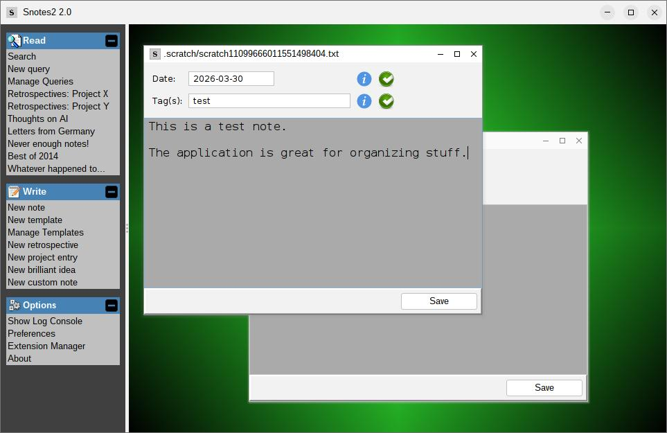
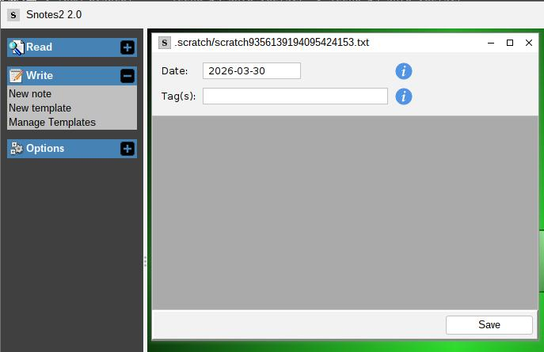
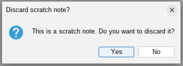
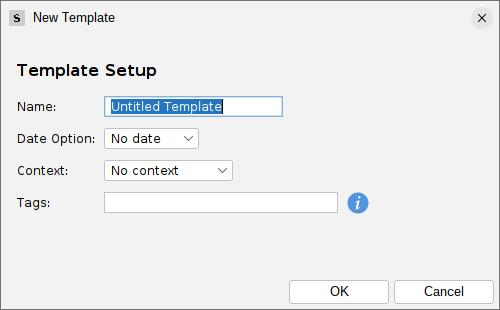
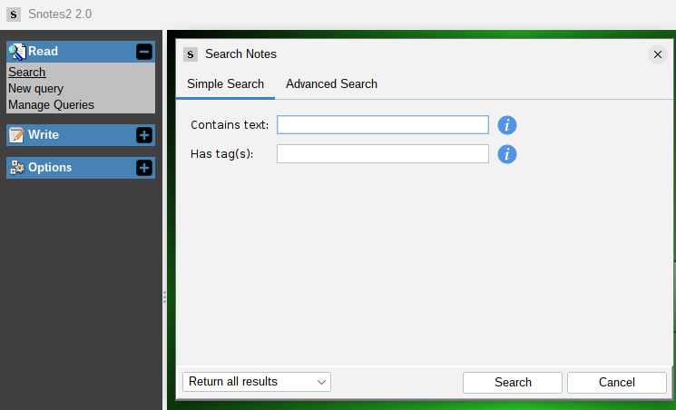
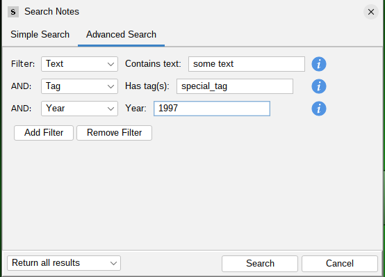
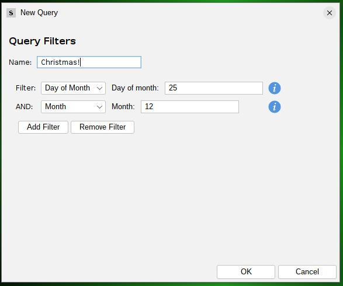
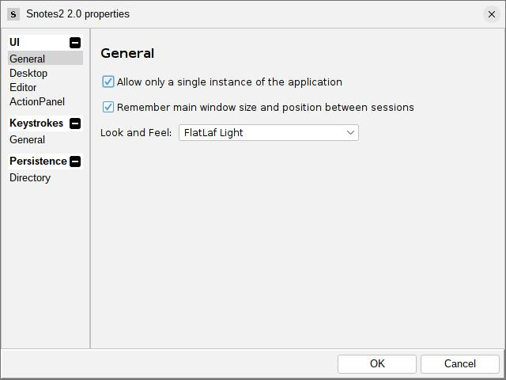

# Snotes

## What is this?

Snotes (Steve's Notes) is a note-taking and note-organizing application built in Java Swing, using my own
[swing-extras](https://github.com/scorbo2/swing-extras) library. Notes can be dated and semantically tagged,
allowing for effortless searching.



## How do I get it?

### Option 1: Installer tarball

If you are running on Linux, and have Java 17 or higher installed, you can download the installer tarball:

- [Snotes Installer](https://www.corbett.ca/apps/Snotes-2.0.tar.gz)
- Size: TODO
- Sha256: `TODO`

This is the best option, as you get an installer script that sets everything up for you:

- desktop shortcut
- desktop menu integration
- launcher script in your PATH (so you can run `Snotes` from the terminal)
- uninstaller script that removes all of the above

### Option 2: Build from source

You can clone the Snotes repository from GitHub and build it with maven:

```bash
git clone https://github.com/scorbo2/snotes.git
cd snotes
mvn clean package

# Run the executable jar that Maven created:
cd target
java -jar snotes-2.0.jar
```

## User guide

### Creating a new note from "scratch"

From the "Write" tab in the action panel on the left, click the "New note" link. This will bring up the
note editor:



We see in the title bar of the editor that the note was created as a "scratch" note, with a long random filename.
This is just temporary. When we save the note, it will be given a proper home in the Snotes data directory,
and will be renamed to match the note's date and/or tag list.

We see that the "Date" field has defaulted to today's date. The date field is optional, and can be blanked out.
Most notes are dated, which makes them easier to search later (see "searching for notes" below). However,
some notes aren't specific to any date, so it makes sense to leave them undated.

The "Tag(s)" field is empty by default, but must contain at least one tag before the note can be saved.
"Tags" are any keyword that you want to semantically associate with the note. This could be a project name,
or a person's name, or the name of a city or town, or anything else that might be associated. You can add
multiple tags by separating them with spaces or commas. Tags can make it MUCH easier to search for notes later,
if you make good use of this field.

If you attempt to close the editor without saving, you'll receive the following prompt:



Clicking "yes" on the discard prompt will delete this scratch note. Clicking "no" will keep it as a scratch
note. You can come back to it later and continue editing - you haven't lost the note by closing the editor.

When you save a scratch note, it will be moved into the Snotes data directory, and renamed
to match the note's date and/or tag list. For example, if you save a note with the date "2024-01-01"
and the tags "projectx" and "projecty", it will be saved to the following file:

```shell
${SNOTES_DATA_DIR}/2024/01/01/projectx_projecty.txt
```

(Note that the Snotes data dir is defined in settings. See "Setting options" below for more information.)

If your note was undated, it will be saved to a `static` directory, like this:

```shell
${SNOTES_DATA_DIR}/static/projectx_projecty.txt
```

Either way, your new note is immediately searchable by date, by tag, and/or by contents!

### Creating a new note from a template

Templates allow you to create notes with the date and/or tag fields pre-filled.
This is handy if you have notes that you create frequently with the same values.
Templates are very easy to create! Click the "New template" link in the "Write" tab of the action panel,
and fill out the form:



You have to supply the following:

- Name: this is any unique name you wish to give the template. This is how it will appear in the action panel.
- Date: your options are "No date", "Yesterday's date", "Today's date", and "Tomorrow's date". The date is resolved when
  the Template is used to create a new note.
- Tags: enter the list of tag(s) that you want to pre-fill when a note is created from this template.
- Context: you can select to display read-only "context" in the editor. All notes that match the tag(s) that you have
  entered on this form will be retrieved, and they will be displayed in the editor as read-only context. You can
  choose "All", "None", or "Most recent 1/3/5/10". This is a great way to have relevant notes at your fingertips when
  you're writing a new note.

When you click "OK", the new template is created and will be immediately available in the "Write" tab of the action
panel. Just click on it to bring up a new scratch note in the editor, with the date and tags pre-filled according to the
template. You can then edit the note as you normally would, and save it when you're done.

### Searching for notes

Select "Search" from the "Read" tab in the action panel (or press Ctrl+F) to bring up the search dialog:



The dialog defaults to "simple search", which is very keyboard friendly. The focus is in the "Contains text"
field, so you can simply type the text that you're looking for and hit Enter to search. Or, hit the tab key
to move focus to the "Has tag(s)" field, and type the tag(s) that you want to search for.
You can separate multiple tags with spaces or commas. Press Enter to search, and the results will be displayed
in a read-only dialog.

Alternatively, select the "Advanced Search" tab to bring up the advanced search options:



Here, we can enter up to eight filters to narrow down our search. The filters are:

- Text: enter text to search for (case-insensitive)
- Text (exact): enter text to search for (case-sensitive)
- Tag: enter tag(s) to search for
- Date: enter a specific date (in yyyy-MM-dd) format to search for
- Year: enter a specific year to search for
- Month: enter a specific month (01-12) to search for, regardless of year. For example, enter "01" to find all notes
  that have ever been entered in January (in any year).
- Day of month: enter a specific day of the month (1-31) to search for, regardless of month or year. For example,
  enter "15" to find all notes that were entered on the 15th of any month (in any year). This naturally combines with
  the Month filter! You can select "Month: 12" and "Day of month: 25" to find all notes that were entered on December
  25th of any year.
- Day of Week: enter a specific day of the week (Monday-Sunday) to search for, regardless of date. For example,
  enter "Monday" to find all notes that were entered on a Monday (in any month and year).
- Undated only: select this to return only notes that have no date associated with them.

### Using Queries

If there's a particular search that you perform frequently, you can set up a Query, to avoid having to re-enter all the
filters. This is very easy to set up! Select "New query" from the "Read" tab in the action panel, and fill out the form:



Here, we can enter a Query name, which will be used to identify this Query in the action panel. The filter options
should look very familiar - they are the same as the filters in the advanced search dialog. You can enter any
combination of filters that you like, and when you click "OK", your new Query will be created and will be immediately
available in the "Read" tab of the action panel. Just click on it to execute the query and see the results!

### Setting options

Choose "Preferences" from the "Options" tab in the action panel to bring up the options dialog:



There are numerous options here for changing the behavior and appearance of Snotes. You can change the editor
fonts and colors, you can change the application Look and Feel, and you can select a different data directory.
Here, you can also customize the keyboard shortcuts that the application uses. Clicking OK applies and saves
the changes with immediate effect.

## Extending Snotes

Snotes is built on the `swing-extras` library, which has a built-in application extension mechanism.
This means that you can write your own Snotes extensions in Java, package them into a jar file,
and load them dynamically at runtime! Refer to the Javadocs for `SnotesExtension` and `SnotesExtensionManager`
for more information, or refer to the [swing-extras book](https://www.corbett.ca/swing-extras-book/) and its
section on application extensions.

## Bug reports or feature requests

The [GitHub issues page](https://github.com/scorbo2/snotes/issues) is the best place to report bugs or request
features.
Please check there first to see if your issue has already been reported, and if not, feel free to open a new issue!

## License

Snotes is licensed under the MIT License. See the [LICENSE](LICENSE) file for details.

## Version history

Refer to the [Release Notes](src/main/resources/ca/corbett/snotes/ReleaseNotes.txt) for a detailed version history.
